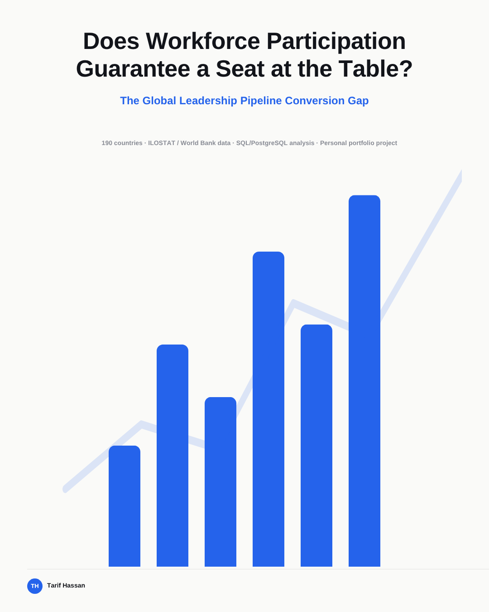

# Does Workforce Participation Guarantee a Seat at the Table?
### The Global Leadership Pipeline Conversion Gap

Women are often well-represented in national workforces — but does that presence convert into management representation, or does it stall before reaching the top? This project measures the gap between the two across 190 countries, and finds it isn't just wide, it's worst exactly where you'd least expect it.

Public dataset (ILOSTAT / World Bank) · PostgreSQL / SQL analysis · Personal portfolio project

---

## The Question & Method

**Conversion ratio = female manager share ÷ female employment share.**

A ratio below 1.0 means women hold management roles at a lower rate than their presence in the workforce would predict — participation without proportional power. A ratio at or above 1.0 means women hold management roles at or above their workforce share.

Each country uses its own most recent available clean data year rather than a single fixed year across all countries, since reporting years vary by country. 92% of countries report 2010 or later, and 74% report since 2020.

The raw data spans three ISCO occupational-classification vintages. **ISCO-68 was excluded entirely** — it conflates managers with armed forces personnel, which would silently distort the manager counts. After exclusion, 5,315 usable country-years remain across 190 countries.

## The Finding

**115 of 190 countries (60.5%) show high female workforce participation paired with poor conversion into management** — the core decoupling pattern this project set out to test for.

That gap is not evenly spread. Broken down by income group, the poor-conversion rate is:

| Income group | Poor conversion rate | Countries |
|---|---|---|
| **High income** | **80.6%** | 54 of 67 |
| Upper middle income | 50.0% | 28 of 56 |
| Lower middle income | 48.9% | 22 of 45 |
| Low income | 50.0% | 11 of 22 |

High-income economies underconvert at nearly double the rate of every other income band, which sit close together around 50%. This isn't a developing-economy story — it's most severe in the world's wealthiest countries, including **Germany** (conversion ratio 0.643, ranked 6th-worst among high-income economies). The high-income poor-conversion group is broad-based, not a handful of small outliers: it includes Japan, Korea, Germany, the Netherlands, Switzerland, France, the UK, Australia, and the US.

## The Ranking

The highest conversion ratios in the dataset: **Niger (1.625), Belize (1.446), Burkina Faso (1.378), Sudan (1.357), Liberia (1.062), Malawi (1.05)**.

These are genuine outliers, not a representative pattern. Within the low-income group as a whole, **17 of 22 countries still underconvert** (ratio below 1.0), several sharply — Afghanistan (0.261), Guinea-Bissau (0.4). The group median sits close to every other income band. The five countries above 1.0 shouldn't be read as evidence that low-income economies convert better in general; they're exceptions against a group that, like the rest of the world, mostly underconverts.

## The Verdict

**Participation isn't converting into power — least of all in wealthy economies.** Across 190 countries, workforce presence and management representation are decoupled for 60.5% of the world, and the decoupling is worst in high-income economies rather than best, as the intuitive prior might suggest.

---

## How this was built

Everything in this repo is real, reproducible SQL work against public data — nothing here is simulated or estimated.

- **`sql/00_setup/`** — schema creation (`raw` and `clean` schemas in the `leadership_pipeline` database)
- **`sql/01_load/`** — loading three raw landing tables: `raw.emp_sex_occupation` (ILOSTAT employment by sex/occupation, 227,664 rows), `raw.sdg_women_managers` (ILO's own published SDG 5.5.2 figure, 1,823 rows), and `raw.wb_country_class` (World Bank region/income classification, 268 rows)
- **`sql/02_audit/`** — full data-quality audit: 6,228 total country-years, 292 (4.7%) excluded for ISCO-68-only reporting, leaving 5,315 usable country-years across 294 ILOSTAT codes; 196 identified as the real matched analysis universe against World Bank country codes; zero integrity violations (female counts never exceed total counts)
- **`sql/03_clean/`** — `clean.country_year_managers` built with a corrected `OCU_` classification-code prefix (a first-pass bug that silently NULLed every manager figure); reconciled against ILO's own published figures; added a `data_quality_flag` column marking 101 of 2,958 rows (3.4%) showing >30-point swings between manager-share and employment-share ratios, retained but excluded from headline analysis
- **`sql/04_analysis/`** — the core equity analysis: conversion ratio rankings, the income-group decoupling breakdown, two validation checks (confirming the high-income poor-conversion group is broad-based, and confirming the low-income outliers aren't representative), and trend analysis using `REGR_SLOPE()` (fastest-improving countries: Bhutan, Botswana, Kosovo)

**Two real bugs caught and fixed along the way**, both documented inline in the SQL:
- `raw.wb_country_class` initially loaded with `income_group` and `lending_category` 100% NULL — not a CSV issue, but a DBeaver import wizard silently creating two new quoted columns (`"Income group"`, `"Lending category"`) instead of mapping to the existing ones. Fixed by dropping the phantom columns and remapping the import explicitly.
- ILOSTAT uses `KOS` for Kosovo; the World Bank classification file uses `XKX`. Without an explicit mapping, every join silently dropped Kosovo — one of the project's three trend leaders — from every income-grouped result.

**Data sources:**
- [ILOSTAT bulk data](https://ilostat.ilo.org/data/) — employment by sex and occupation, and the SDG 5.5.2 indicator
- [World Bank country and lending group classifications](https://datahelpdesk.worldbank.org/knowledgebase/articles/906519)

**Full presentation deck:** [`deck/Global_Leadership_Pipeline.pdf`](deck/Global_Leadership_Pipeline.pdf)

**Tools:** PostgreSQL 18, DBeaver, Git

---

*Tarif Hassan — [LinkedIn](https://linkedin.com/in/tarifhassan27)*
